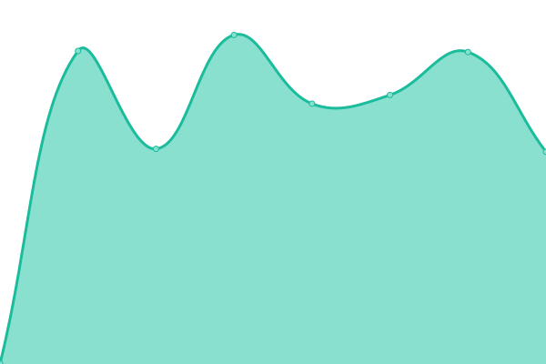
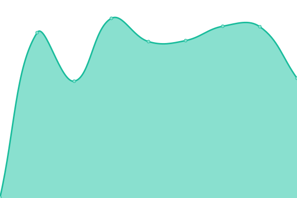

# [📈 Live Status](https://demo.upptime.js.org): <!--live status--> **Todos os sistemas operacionais**

This repository contains the open-source uptime monitor and status page for [Francis Vagner dos Anjos Fontoura](https://demo.upptime.js.org), powered by [Upptime](https://github.com/upptime/upptime).

With [Upptime](https://upptime.js.org), you can get your own unlimited and free uptime monitor and status page, powered entirely by a GitHub repository. We use [Issues](https://github.com/francisfontoura/upptime/issues) as incident reports, [Actions](https://github.com/francisfontoura/upptime/actions) as uptime monitors, and [Pages](https://demo.upptime.js.org) for the status page.

<!--start: status pages-->
<!-- This summary is generated by Upptime (https://github.com/upptime/upptime) -->
<!-- Do not edit this manually, your changes will be overwritten -->
<!-- prettier-ignore -->
| URL | Status | History | Response Time | Uptime |
| --- | ------ | ------- | ------------- | ------ |
|  [API](https://e2.ciga.sc.gov.br/graphql) | No ar | [api.yml](https://github.com/francisfontoura/upptime/commits/HEAD/history/api.yml) | 

 973ms
     
 | 

<a href="https://status.eciga.consorciociga.gov.br/history/api">100.00%</a>
    

|  [MongoDB](https://exporters.eciga.consorciociga.gov.br/metrics) | No ar | [mongo-db.yml](https://github.com/francisfontoura/upptime/commits/HEAD/history/mongo-db.yml) | 

 750ms
     
 | 

<a href="https://status.eciga.consorciociga.gov.br/history/mongo-db">100.00%</a>
    

|  [Redis](https://exporters.eciga.consorciociga.gov.br/metrics) | No ar | [redis.yml](https://github.com/francisfontoura/upptime/commits/HEAD/history/redis.yml) | 

 290ms
     
 | 

<a href="https://status.eciga.consorciociga.gov.br/history/redis">100.00%</a>
    

|  [SSO](https://sso.ciga.sc.gov.br/auth/realms/master) | No ar | [sso.yml](https://github.com/francisfontoura/upptime/commits/HEAD/history/sso.yml) | 

 844ms
     
 | 

<a href="https://status.eciga.consorciociga.gov.br/history/sso">100.00%</a>
    

<!--end: status pages-->

[**Visit our status website →**](https://demo.upptime.js.org)

## 📄 License

- Powered by: [Upptime](https://github.com/upptime/upptime)
- Code: [MIT](./LICENSE) © [Anand Chowdhary](https://anandchowdhary.com), supported by [Pabio](https://pabio.com)
- Data in the `./history` directory: [Open Database License](https://opendatacommons.org/licenses/odbl/1-0/)
